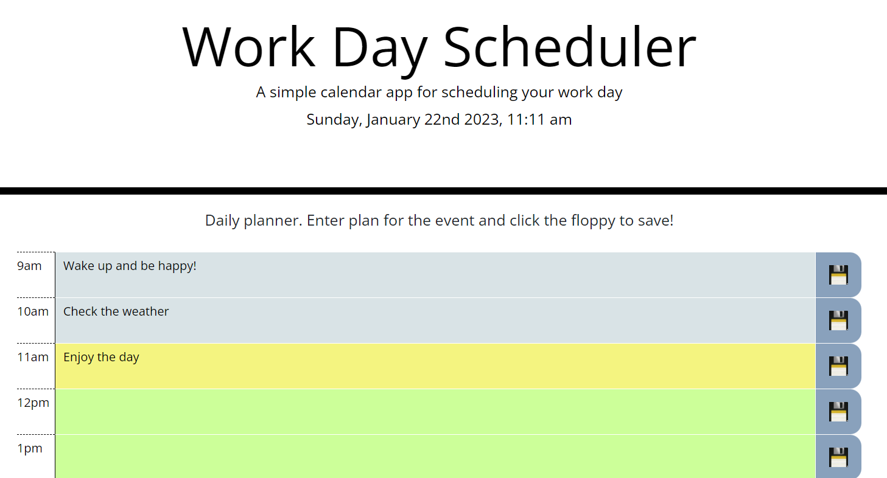

# Project Title

Daily Planner

## Screenshot

## Description

This app allows you to add and modify planned asticities for day
Normal hours are used from 9am to 5pm, with 1 hour steps
You can add, save and edit the entries. 
Items are saved locally on your computer.
You may

## Getting Started

follow this link
https://mihacuo.github.io/Daily_Planner/
Add your plan
Click floppy to save
Come back and see the schedule
Amend if required

### Dependencies

* Any modern Web browser

### Installing

no installation needed, runs from the browser

## Help

reach us at
mihhail.odnolko@gmail.com

## Authors

Mihhail Odnolko
https://github.com/mihacuo

## Version History

* 1.0
    * Initial Release

## License

This project is licensed under the [Daily Planner] License - see the LICENSE.md file for details
MIT License

## Acknowledgments

BootCamp 2022-2023 UK cohort